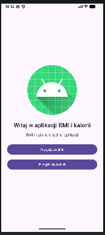
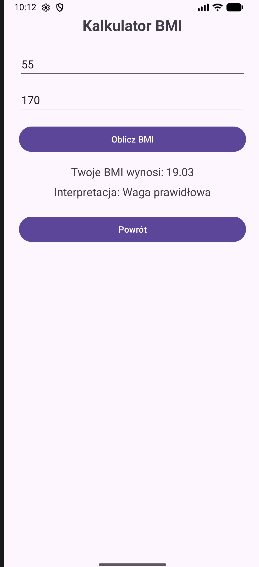
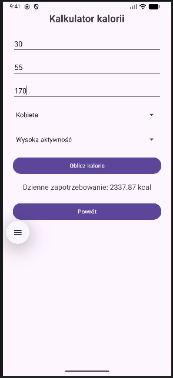

# Kalkulator BMI i kalorii

Aplikacja mobilna napisana w Kotlinie w Android Studio.

---

## Opis projektu

Aplikacja umożliwia:
- obliczenie wskaźnika BMI
- interpretację wyniku BMI
- obliczenie dziennego zapotrzebowania kalorycznego

Użytkownik może wprowadzić swoje dane i otrzymać szybkie wyniki wraz z interpretacją.

---

## Funkcjonalności

- ekran startowy z grafiką
- kalkulator BMI (waga + wzrost)
- interpretacja BMI:
    - niedowaga
    - waga prawidłowa
    - nadwaga
    - otyłość
- kalkulator kalorii
- uwzględnienie:
    - wieku
    - wagi
    - wzrostu
    - płci
    - poziomu aktywności fizycznej

---

## 🧮 Wzory
### Wzór Harrisa-Benedicta

**Kobieta:**
655.1 + (9.563 × masa) + (1.850 × wzrost) − (4.676 × wiek)

**Mężczyzna:**
66.5 + (13.75 × masa) + (5.003 × wzrost) − (6.775 × wiek)
### BMI
BMI = masa / (wzrost × wzrost)

---

##  Screeny aplikacji

### Ekran startowy

### Kalkulator BMI

### Kalkulator kalorii

---

## Technologie

- Kotlin
- Android Studio
- XML Layout

---

## Autor

Katarzyna Kasperek